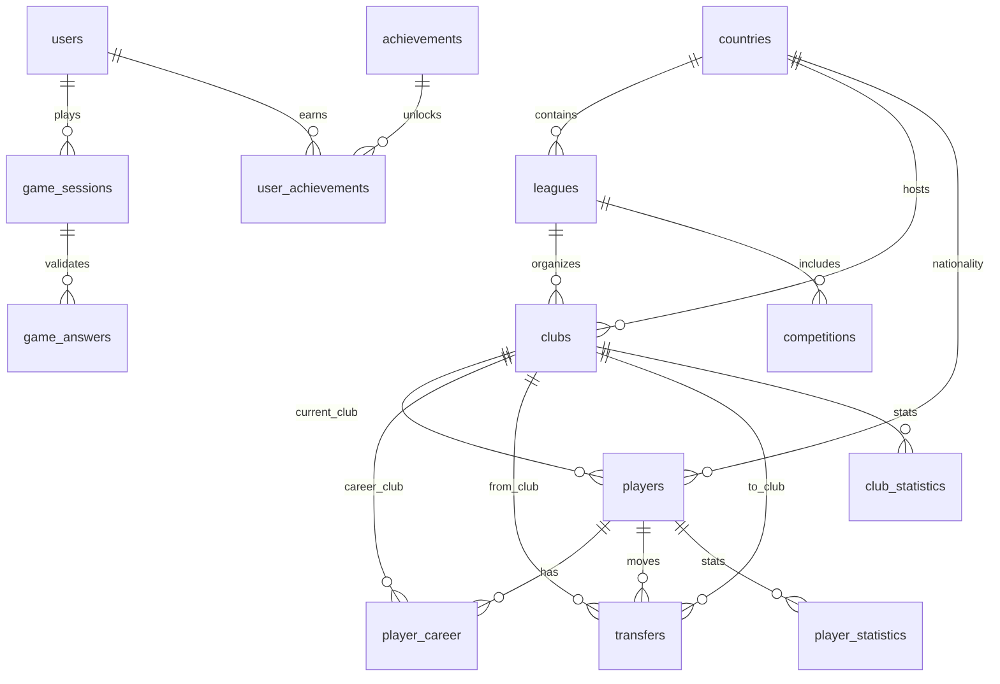

# FOOTBALL IDENTITY ERD

```mermaid
erDiagram
  countries ||--o{ leagues : contains
  countries ||--o{ clubs : hosts
  countries ||--o{ players : nationality
  leagues ||--o{ clubs : organizes
  leagues ||--o{ competitions : includes
  clubs ||--o{ players : current_club
  players ||--o{ player_career : has
  clubs ||--o{ player_career : career_club
  players ||--o{ transfers : moves
  clubs ||--o{ transfers : from_club
  clubs ||--o{ transfers : to_club
  players ||--o{ player_statistics : stats
  clubs ||--o{ club_statistics : stats
  users ||--o{ game_sessions : plays
  game_sessions ||--o{ game_answers : validates
  achievements ||--o{ user_achievements : unlocks
  users ||--o{ user_achievements : earns
```

Data penting menyimpan `source`, `source_id`, dan `last_updated`. Jika nilai tidak tersedia dari sumber, UI menampilkan `Data not available`, bukan data karangan.
